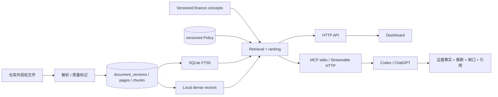

# Internal Research MCP 架构

## 1. 架构结论

本仓库同时包含 Retrieval Hub 和 Dashboard，但只有后端拥有数据、检索和排序。HTTP 与 MCP 是同一 Retrieval Service 的两个 transport；Dashboard 和 Codex/ChatGPT 都不能实现影子 ranking。



## 2. 数据与版本

- `documents` 保存稳定的 `source_id + external_id` 业务身份。
- `document_versions` 保存不可变 title/body/date/metadata/parser version。
- `document_versions.body_sha` 保存规范化抽取正文的确定性 SHA-256；检索结果按该值折叠完全相同正文，但版本和来源记录不删除。
- `documents.current_version_id` 原子指向当前版本。
- `version_pages` 保存页码和正文 offset。
- `chunks` 从属于特定 version；新内容不会复用旧 offset。
- FTS5 只索引 current version，历史 version 继续保留用于审计和未来历史引用接口。
- `schema_migrations` 显式记录数据库演进。

## 3. Retrieval/ranking

流程：短句概念规划 → source/date/metadata 过滤 → FTS5 与 dense-vector 双路召回 → 文档级 RRF → 完全相同正文折叠 → 服务端来源权重和新鲜度 → 排序与截断。

```text
hybrid_relevance = 60 / (60 + lexical_rank) + 40 / (60 + semantic_rank)
freshness = 0.5 ^ (age_days / half_life_days)
score = hybrid_relevance × source_weight × (1 + recency_boost × freshness)
```

`backend/src/research_hub/config/retrieval_concepts.json` 保存可审计、随 Python 包分发的公司/产品/产业链别名，不把词典散落在代码中。例如“英伟达具体显卡”同时规划 NVIDIA 实体与 H100/H200/B200/GB200/Blackwell 等产品概念；dense query 保留原短句并附加概念，而不是召回所有含“芯片”的文章。语义相似度先经过质量门槛，来源权重只能作用于门槛后的候选。

本地向量层使用 FastEmbed 的多语 MiniLM（384 维）和 NumPy normalized exact cosine。索引元数据记录模型、维度、语料摘要、概念版本和构建时间；语料变化时自动回退 FTS，直到重建。约 6 万 chunk 时该方案便于审计和部署；持续 P95 超标或 chunk 进入数十万级时再替换为 ANN 适配器。

Policy 和候选在同一个只读事务快照中读取；SearchResponse 返回准确 `policy_version`。分数不表示概率。

### 3.1 MCP V0 信息源优先级

V0 用版本化 `source_rankings_v0.json` 表达 Priority 1–4、默认权重、来源角色和显式 alias。配置只包含虚构 fixture；真实来源名单不进入 Git。

一份 V0 文档只选择一个 `primary ranking source`，并把该稳定 ID 映射到现有 `source_id`。分析师、报告作者、邮件发送人、发布机构和 ingestion channel 不会同时相乘。解析只接受 canonical name 或显式 alias；同名冲突返回 `ambiguous`，未知名称返回 `unmatched`，不会用 fuzzy match 静默合并。

V0 不改变评分公式或 MCP schema：tier 默认权重通过现有 `RetrievalPolicy.source_weights` 应用，仍在 hybrid relevance 形成之后参与计算。未来多来源 attribution、来源解析状态展示和邮件批次枚举必须通过新的数据迁移与契约提案实现。

### 3.2 MCP V1 邮件信息源持久化

V1 用 `source_rankings_v1.json` 保留独立目录版本；schema migration v3 将目录投影为 `information_sources` 和 `information_source_aliases`，并以 `document_source_attributions` 记录特定不可变 document version 的解析结果。EML parser 只从邮件头保留显式 sender name/address/Message-ID；不会从正文猜测作者。

`email_sync_runs` 冻结时间窗和预期文件夹，`email_sync_items` 记录每封返回邮件的 imported/skipped/failed 状态。完成批次必须为全部预期文件夹提供计数，包括零结果文件夹；总数必须与 item 数一致。该确定性覆盖层与 RAG Top-K 分离。

V1 仍使用一个主 ranking source，并同步到现有 `sources` 供 Policy/Dashboard 使用；分发渠道与邮箱文件夹只作为 metadata。这样 OpenAPI 1.0.0 与 MCP tools 不变。多来源联合归因、alias 管理 UI 和只读批次枚举属于后续契约升级。

## 4. HTTP 与 MCP

HTTP 1.1.0 保留 API 1.0.0 的检索与 Policy 路径，并新增 ingestion summary、item 列表/详情和 Admin retry；1.0.0 已完整归档。默认模式下管理操作使用 Admin Token，读取使用 Read/Admin Token；Policy 和 ingestion retry 均使用显式版本进行乐观锁。本机单人 Demo 可通过显式 `serve --local-no-auth` 跳过 Bearer 校验；该开关不改变 OpenAPI DTO、MCP tool schema 或授权模式的默认行为，CLI 仍固定绑定 `127.0.0.1`。

MCP 暴露三个只读工具：

- `search`：轻量候选发现；
- `fetch`：读取当前完整文档；
- `search_documents`：高级过滤、证据片段、citation 和 Policy 版本。

MCP handler 直接调用 `RetrievalHub.search/fetch`。Server instructions 要求模型先检索和读取，再区分文档事实、模型推断、冲突观点和信息缺口。

## 5. Codex 与 ChatGPT 可达性

- 本地 Codex：stdio MCP，由客户端启动本地 Python 进程。
- 本地 Inspector/API 环境：`http://127.0.0.1:8765/mcp`。
- ChatGPT developer mode：需要 ChatGPT 可达的 HTTPS `/mcp` 或 Secure MCP Tunnel。
- 公开发布不是当前范围；localhost 通过不等于 ChatGPT 已通过。

OpenAI 官方要求 company knowledge 兼容服务实现标准只读 `search`/`fetch`、准确 annotations 和可打开绝对引用 URL。本项目据此把本地 Codex 验收和 ChatGPT 外部验收分开。

## 6. 安全边界

- 原始文件、数据库、Token 和本地 MCP 配置全部 Git ignore。
- MCP 不暴露入库、删除、Policy 写入或任意文件读取。
- 标题、正文和 metadata 是不可信纯文本，不能成为系统指令。
- HTTP/MCP 默认使用 Bearer Token；显式 `--local-no-auth` 仅用于 loopback 单机验收，stdio 依赖本机进程和文件权限边界。
- 默认仅监听 `127.0.0.1`，不自动建立公网 tunnel。

## 7. Dashboard 边界

Dashboard 继续使用类型安全 API client 和 fixture 模式。Live 模式读取同一 Hub，使用 `expected_version` 保存 Policy，并原样展示服务端排序、分数组成和 citation。连接表单的“不启用 Token”只改变 API client 是否发送 `Authorization`，不会在客户端替代服务端权限判断；它必须与后端 `--local-no-auth` 成对使用。

浏览器直接持有 Admin Token 仅适合受控本地演示。生产形态应由受认证的服务端代理管理写权限。

## 8. 扩展边界

- 语义检索通过独立适配器启用；无模型、无索引或索引陈旧时，概念增强关键词检索必须完整工作。
- passage/range fetch 只能以新增工具/契约实现，不能静默改变现有 `fetch`。
- 日增数百份后，以搜索 P95、写锁、同步积压和失败率触发持久队列、PostgreSQL 或 ANN，而不是仅按文件数升级。
- 观点/指标结构化必须保存 provenance 和原文 citation，不能覆盖文档事实。

## 9. 已确认的自动监听扩展边界

下一扩展阶段只接入 Capital IQ 本地目录和 Outlook。Connector/discovery、调度状态与检索信息源是不同概念：新增 ingestion control-plane 记录 checkpoint、batch、item、attempt、lease、dead letter 和状态事件，但解析后的正文仍只进入既有 `documents/document_versions/pages/chunks`，Dashboard 不建立第二套处理事实。

文件或邮件更新创建不可变版本；源端删除只记录 observation，首期不删除历史证据。`processed` 必须表示 FTS 和 dense-vector generation 均已发布；仅能由 FTS 回退检索的新数据仍显示为向量待处理。Outlook 附件必须保留父子 provenance，扫描 PDF 需要 OCR stage，任何必需附件未完成时整封邮件不能标记为完整处理。

阶段 P 的 migration v5 将目录对象的 `size/mtime/stable_since/last_enqueued_fingerprint/deleted_at` 与 worker heartbeat 落库。目录 watcher 先做稳定性判断，再读取并计算内容哈希；达到队列水位时只暂停新增 discovery，不丢失下一轮 reconciliation。当前仍以轮询为事实来源，文件事件仅是后续低延迟优化。

Outlook 侧以认证无关的 `OutlookDeltaClient` 隔离 Graph/Email Skill 适配层：adapter 只提供标准化消息、附件 bytes、`next_cursor` 和最终 `delta_cursor`，Retrieval Hub 才负责幂等、父子状态、解析、来源归因、索引和发布。checkpoint 在 durable discovery 后推进。`OCRAdapter` 同样可替换；未配置时扫描 PDF 会显式失败并阻止必需父邮件发布。现阶段只有虚构 adapter 通过自动测试，不能据此声称真实 Microsoft 账号已接通。

部署边界仍为本机 `127.0.0.1`。首期保留全部运行数据，并使用 SQLite WAL 与单机 worker；retention、PostgreSQL、多用户、ACL、多主机 worker 和公网/局域网访问均属于后续更新。详细方案见 `docs/memos/AUTOMATED_INGESTION_MONITORING_PLAN.md`。
